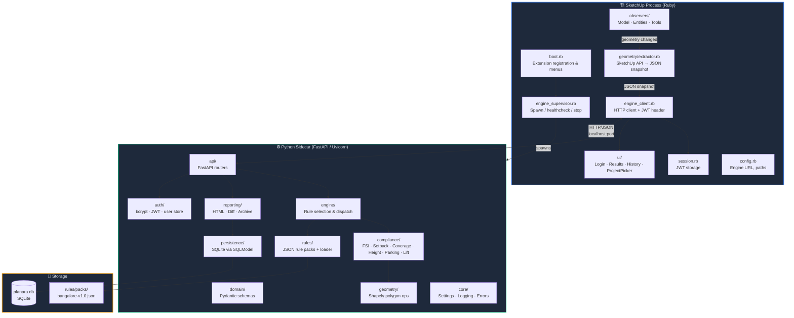
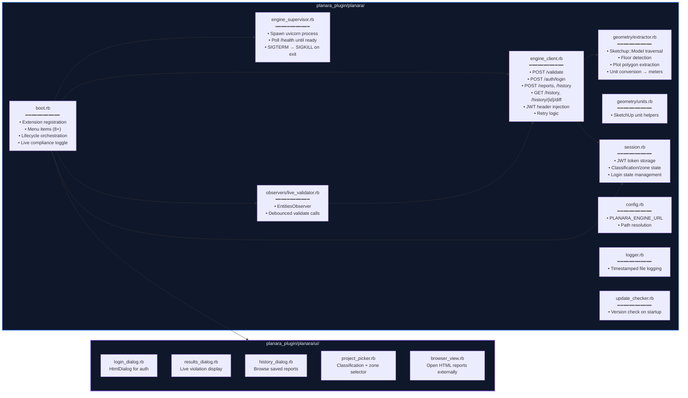
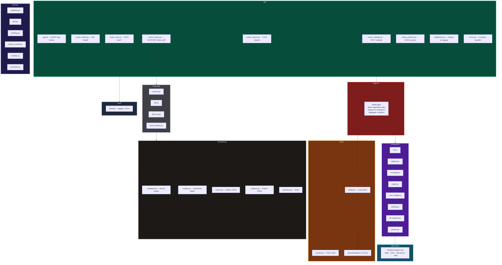
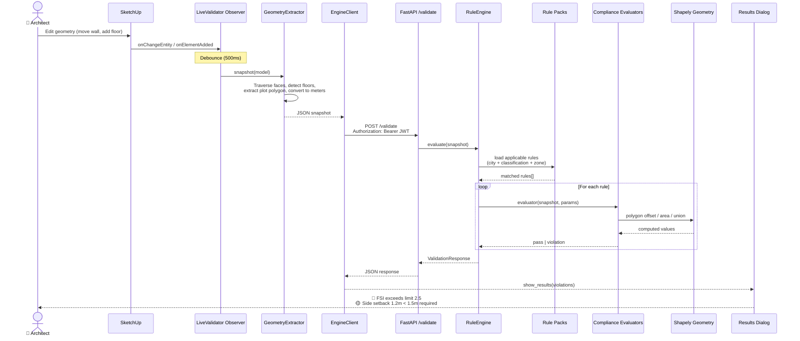
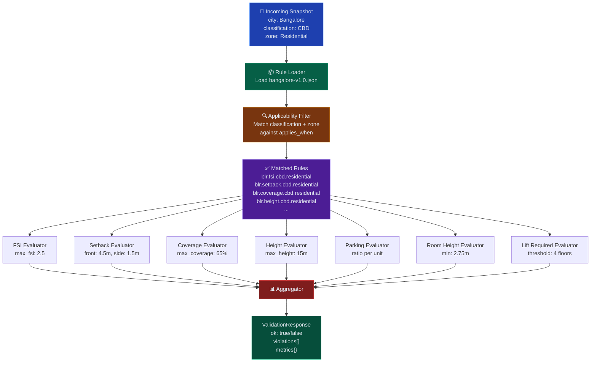
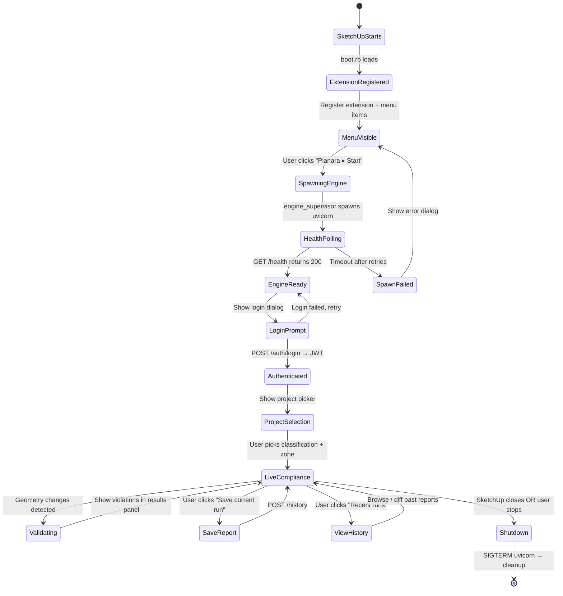

# Planara Plugin — Architecture Diagrams

## 1. High-Level System Topology

The plugin is a **hybrid Ruby + Python** system. SketchUp only speaks Ruby, so a thin Ruby shell extracts geometry and forwards it over localhost HTTP to a Python sidecar that does all the heavy compliance work.



---

## 2. Ruby Plugin — Module Breakdown



---

## 3. Python Engine — Module Breakdown



---

## 4. Data Flow — Validation Pipeline

This is the core flow: user edits geometry in SketchUp → violations appear in real time.



---

## 5. API Surface

```mermaid
graph LR
    subgraph Routes["FastAPI Route Map"]
        H["GET /health<br/>Engine status check"]
        A1["POST /auth/register<br/>Create user account"]
        A2["POST /auth/login<br/>Returns JWT token"]
        V["POST /validate<br/>Core compliance check"]
        R1["POST /reports<br/>Stateless report render"]
        R2["GET /reports/html<br/>HTML report view"]
        H1["POST /history<br/>Save validation + persist"]
        H2["GET /history<br/>List saved reports (paginated)"]
        H3["GET /history/{id}<br/>Full archived report"]
        H4["GET /history/{id}/diff<br/>Auto-diff vs. prior run"]
        H5["GET /history/diff?from=X&to=Y<br/>Explicit two-report diff"]
        H6["GET /history/{id}/html<br/>HTML view of saved report"]
        H7["GET /history/{id}/diff/html<br/>HTML diff view"]
        P1["POST /projects<br/>Create project"]
        P2["GET /projects<br/>List projects"]
        P3["GET /projects/{id}<br/>Get project"]
        P4["PATCH /projects/{id}<br/>Update project"]
    end

    subgraph Auth["🔒 Auth Required"]
        V
        R1
        R2
        H1
        H2
        H3
        H4
        H5
        H6
        H7
        P1
        P2
        P3
        P4
    end

    style Routes fill:#0f172a,stroke:#3b82f6,stroke-width:2px,color:#e2e8f0
    style Auth fill:#7f1d1d,stroke:#ef4444,stroke-width:1px,color:#fca5a5
```



---

## 6. Rule Engine Pipeline



---

## 7. Application Lifecycle



---

## 8. File Tree Summary

```
Planara-Plugin/
├── planara_plugin/                    # Ruby — SketchUp extension shell
│   ├── loader.rb                      # SketchUp extension entry point
│   └── planara/
│       ├── boot.rb                    # Lifecycle, menus, orchestration
│       ├── config.rb                  # Engine URL, path config
│       ├── engine_client.rb           # HTTP client → Python engine
│       ├── engine_supervisor.rb       # Spawn/stop Python sidecar
│       ├── session.rb                 # JWT + project state
│       ├── logger.rb                  # File-based logging
│       ├── update_checker.rb          # Version check
│       ├── geometry/
│       │   ├── extractor.rb           # SketchUp model → JSON snapshot
│       │   └── units.rb               # Unit conversion helpers
│       ├── observers/
│       │   └── live_validator.rb      # Debounced auto-validation
│       └── ui/
│           ├── login_dialog.rb        # Auth HtmlDialog
│           ├── results_dialog.rb      # Live violations panel
│           ├── history_dialog.rb      # Report history browser
│           ├── project_picker.rb      # Zone/classification picker
│           ├── browser_view.rb        # External HTML report viewer
│           └── assets/                # CSS, JS, images for dialogs
│
├── planara_engine/                    # Python — FastAPI compliance engine
│   └── src/planara_engine/
│       ├── api/                       # HTTP layer (no business logic)
│       │   ├── app.py                 # FastAPI app factory
│       │   ├── routes_validate.py     # POST /validate
│       │   ├── routes_auth.py         # POST /auth/*
│       │   ├── routes_health.py       # GET /health
│       │   ├── routes_reports.py      # POST /reports, GET /reports/html
│       │   ├── routes_history.py      # CRUD /history + diff endpoints
│       │   ├── routes_projects.py     # CRUD /projects
│       │   ├── middleware.py          # Request-ID, logging
│       │   └── errors.py             # Exception → HTTP response
│       ├── auth/                      # JWT mint/verify, bcrypt, user store
│       ├── domain/                    # Pydantic models (THE contract)
│       │   ├── snapshot.py            # DesignSnapshot schema
│       │   ├── plot.py                # Plot polygon + metadata
│       │   ├── building.py            # Building + Floor schemas
│       │   ├── project_context.py     # City/classification/zone
│       │   ├── violation.py           # Violation + ValidationResponse
│       │   └── geometry.py            # Polygon type definitions
│       ├── rules/                     # Declarative rule system
│       │   ├── schema.py              # Rule model
│       │   ├── loader.py              # Load + index rule packs
│       │   └── packs/                 # JSON rule packs per city
│       ├── engine/                    # Rule selection + dispatch
│       ├── compliance/                # One evaluator per bylaw concern
│       │   ├── fsi.py                 # Floor Space Index
│       │   ├── setback.py             # Building setbacks
│       │   ├── coverage.py            # Ground coverage %
│       │   ├── height.py              # Building height limits
│       │   ├── room_height.py         # Minimum room height
│       │   ├── parking.py             # Parking requirements
│       │   ├── lift_required.py       # Lift/elevator requirements
│       │   └── params.py              # Shared param extraction
│       ├── geometry/                  # Shapely polygon operations
│       ├── reporting/                 # Output formatting
│       │   ├── archive.py             # ArchivalReport builder
│       │   ├── html_renderer.py       # Standalone HTML reports
│       │   ├── diff.py                # Report comparison logic
│       │   └── diff_html.py           # HTML diff renderer
│       ├── persistence/               # Data layer
│       │   ├── database.py            # SQLite engine + sessions
│       │   ├── models.py              # SQLModel table definitions
│       │   ├── reports.py             # Report repository
│       │   ├── projects.py            # Project repository
│       │   └── repository.py          # Base repository
│       └── core/                      # Cross-cutting concerns
│
├── bangalore_bylaws/                  # Reference bylaw documents
├── legacy/SV-Abid/                    # Original Ruby-only prototype
├── scripts/                           # Build & dev scripts
└── docs/                              # Additional documentation
```
